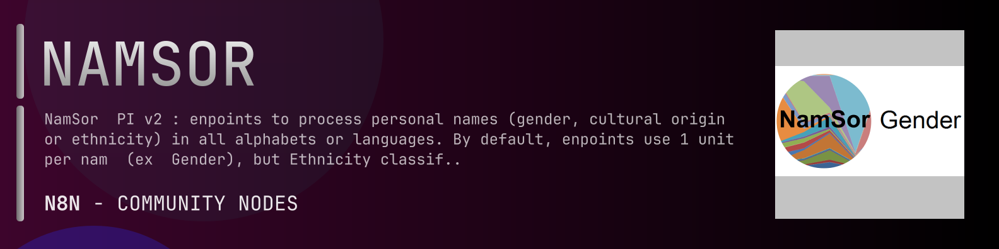

# @n8n-dev/n8n-nodes-namsor



[](https://www.npmjs.com/package/@n8n-dev/n8n-nodes-namsor)
[](https://opensource.org/licenses/MIT)

---

**Stop writing namsor API integrations by hand.**

Every time you connect n8n to namsor, you waste hours mapping endpoints, defining parameters, and debugging schemas. You copy-paste from docs, fix edge cases, and pray nothing breaks.

**What if connecting n8n to namsor took 5 minutes, not half a day?**

This node gives you **7+ resources** out of the box: **Personal**, **Social**, **Chinese**, **Japanese**, **Indian**, and 2 more: with full CRUD operations, typed parameters, and zero manual configuration.

---

## What You Get

- **Zero boilerplate**: Resources, operations, and fields are pre-configured and ready to use
- **Full CRUD**: Create, read, update, and delete support where the API allows it
- **Typed parameters**: No more guessing field types
- **Built-in auth**: API key authentication, ready to go
- **Declarative**: Native n8n performance, no custom execute() overhead

---

## Install

```bash
npm install @n8n-dev/n8n-nodes-namsor
```

**Or in n8n:**
1. **Settings → Community Nodes → Install**
2. Search: `@n8n-dev/n8n-nodes-namsor`
3. Click **Install**

---

## Quick Start

1. Install the node (above)
2. Add credentials: **namsor API** → paste your API key
3. Drag the **namsor** node into your workflow
4. Pick a resource → pick an operation → done.

That's it. No configuration files. No code. It just works.

---

## Resources

| Resource | Operations |
|----------|------------|
| Personal | Get uses 20 units per name couple infer several classifications for a cross border interaction between names ex remit travel intl com, Post uses 20 units per name pair infer several classifications for up to 100 cross border interaction between names ex remit travel intl com, Get uses 10 units per name infer the likely country of residence of a personal full name or one surname assumes names as they are in the country of residence or the country of origin, Post uses 10 units per name infer the likely country of residence of up to 100 personal full names or surnames assumes names as they are in the country of residence or the country of origin, Get uses 20 units per name infer the likely ethnicitydiaspora of a personal name given a country of residence iso2 code ex us ca au nz etc, Post uses 20 units per name infer the likely ethnicitydiaspora of up to 100 personal names given a country of residence iso2 code ex us ca au nz etc, Get infer the likely gender of a just a fiven name assuming default us local context please use preferably full names and local geographic context for better accuracy, Get infer the likely gender of a name, Post infer the likely gender of up to 100 names detecting automatically the cultural context, Get infer the likely gender of a full name ex john h smith, Post infer the likely gender of up to 100 full names detecting automatically the cultural context, Get infer the likely gender of a full name given a local context iso2 country code, Post infer the likely gender of up to 100 full names with a given cultural context country iso2 code, Get infer the likely gender of a name given a local context iso2 country code, Post infer the likely gender of up to 100 names each given a local context iso2 country code, Get uses 10 units per name infer the likely country of origin of a personal name assumes names as they are in the country of origin for us ca au nz and other meltingpots  use diaspora instead, Post uses 10 units per name infer the likely country of origin of up to 100 names detecting automatically the cultural context, Get infer the likely firstlast name structure of a name ex john smith or smith john or smith john, Get infer the likely firstlast name structure of a name ex john smith or smith john or smith john for better accuracy provide a geographic context, Post infer the likely firstlast name structure of a name ex john smith or smith john or smith john, Post infer the likely firstlast name structure of a name ex john smith or smith john or smith john giving a local context improves precision, Get uses 10 units per name infer the likely religion of a personal full name nb only for india as of current version, Post uses 10 units per name infer the likely religion of up to 100 personal full names nb only for india as of currently, Get uses 10 units per name infer the likely origin of a name at a country subclassification level state or regeion initially this is only supported for india iso2 code in, Post uses 10 units per name infer the likely origin of a list of up to 100 names at a country subclassification level state or regeion initially this is only supported for india iso2 code in, Get uses 10 units per name infer a us residents likely raceethnicity according to us census taxonomy wnl white non latino hl hispano latino  a asian non latino bnl black non latino optionally add header xoptionusraceethnicitytaxonomy usraceethnicity6classes for two additional classes aian american indian or alaskan native and pi pacific islander, Post uses 10 units per name infer upto 100 us residents likely raceethnicity according to us census taxonomy output is wnl white non latino hl hispano latino  a asian non latino bnl black non latino optionally add header xoptionusraceethnicitytaxonomy usraceethnicity6classes for two additional classes aian american indian or alaskan native and pi pacific islander, Get uses 10 units per name infer a us residents likely raceethnicity according to us census taxonomy using optional zip5 code info output is wnl white non latino hl hispano latino  a asian non latino bnl black non latino optionally add header xoptionusraceethnicitytaxonomy usraceethnicity6classes for two additional classes aian american indian or alaskan native and pi pacific islander, Post uses 10 units per name infer upto 100 us residents likely raceethnicity according to us census taxonomy with optional zip code output is wnl white non latino hl hispano latino  a asian non latino bnl black non latino optionally add header xoptionusraceethnicitytaxonomy usraceethnicity6classes for two additional classes aian american indian or alaskan native and pi pacific islander |
| Social | Get uses 11 units per name infer the likely country and phone prefix given a personal name and formatted  unformatted phone number, Post uses 11 units per name infer the likely country and phone prefix of up to 100 personal names detecting automatically the local context given a name and formatted  unformatted phone number, Get uses 11 units per name infer the likely phone prefix given a personal name and formatted  unformatted phone number with a local context iso2 country of residence, Post uses 11 units per name infer the likely country and phone prefix of up to 100 personal names with a local context iso2 country of residence, Get credits 1 unit feedback loop to better infer the likely phone prefix given a personal name and formatted  unformatted phone number with a local context iso2 country of residence |
| Chinese | Get identify chinese name candidates based on the romanized name ex wang xiaoming, Post identify chinese name candidates based on the romanized name firstname  chinesegivenname lastnamechinesesurname ex wang xiaoming, Post identify chinese name candidates based on the romanized name firstname  chinesegivenname lastnamechinesesurname ex wang xiaoming, Get identify chinese name candidates based on the romanized name ex wang xiaoming  having a known gender male or female, Get return a score for matching chinese name ex  with a romanized name ex wang xiaoming, Post identify chinese name candidates based on the romanized name firstname  chinesegivenname lastnamechinesesurname ex wang xiaoming, Get infer the likely gender of a chinese full name ex, Post infer the likely gender of up to 100 full names ex, Get infer the likely gender of a chinese name in latin pinyin, Post infer the likely gender of up to 100 chinese names in latin pinyin, Get infer the likely firstlast name structure of a name ex   surname given name, Post infer the likely firstlast name structure of a name ex   surname given name, Get romanize the chinese name to pinyin ex   wang surname xiaoming given name, Post romanize a list of chinese name to pinyin ex   wang surname xiaoming given name |
| Japanese | Get infer the likely gender of a japanese name in latin pinyin, Post infer the likely gender of up to 100 japanese names in latin pinyin, Get infer the likely gender of a japanese full name ex, Post infer the likely gender of up to 100 full names, Post identify japanese name candidates in kanji based on the romanized name firstname  japanesegivenname lastnamejapanesesurname with known gender ex yamamoto sanae, Get identify japanese name candidates in kanji based on the romanized name ex yamamoto sanae, Get identify japanese name candidates in kanji based on the romanized name ex yamamoto sanae  and a known gender, Post identify japanese name candidates in kanji based on the romanized name firstname  japanesegivenname lastnamejapanesesurname ex yamamoto sanae, Get romanize japanese name based on the name in kanji, Post romanize japanese names based on the name in kanji, Get return a score for matching japanese name in kanji ex   with a romanized name ex yamamoto sanae, Post return a score for matching a list of japanese names in kanji ex   with romanized names ex yamamoto sanae, Get credits 1 unit feedback loop to better perform matching japanese name in kanji ex   with a romanized name ex yamamoto sanae, Get infer the likely firstlast name structure of a name ex   or yamamoto sanae, Post infer the likely firstlast name structure of a name ex   or yamamoto sanae |
| Indian | Get uses 10 units per name infer the likely indian name castegroup of a personal full name, Post uses 10 units per name infer the likely indian name castegroup of up to 100 personal full names, Get uses 10 units per name infer the likely religion of a personal indian full name provided the indian state or union territory nb this can be inferred using the subclassification endpoint, Post uses 10 units per name infer the likely religion of up to 100 personal full indian names provided the subclassification at state or union territory level nb can be inferred using the subclassification endpoint, Get uses 10 units per name infer the likely indian state of union territory according to iso 31662in based on the name, Post uses 10 units per name infer the likely indian state of union territory according to iso 31662in based on a list of up to 100 names |
| Admin | Get activatedeactivate anonymization for a source, Get read api key info, Get list of classification services and usage cost in units per classification default is 1one unit some api endpoints ex corridor combine multiple classifiers, Get prints the current status of the classifiers a classifier name in apistatus corresponds to a service name in apiservices, Get print current api usage, Get print historical api usage, Get print historical api usage in an aggregated view by service by dayhourmin, Get activatedeactivate learning from a source, Get print basic source statistics, Get the current software version, Get print the taxonomy classes valid for the given classifier |
| General | Get infer the likely type of a proper noun personal name brand name place name etc, Post infer the likely common type of up to 100 proper nouns personal name brand name place name etc, Get infer the likely type of a proper noun personal name brand name place name etc, Post infer the likely common type of up to 100 proper nouns personal name brand name place name etc |

---

## Why This Node?

**Without this node:**
- Hours of manual API integration
- Copy-pasting from namsor docs
- Debugging auth, pagination, error handling
- Maintaining your own client code

**With this node:**
- Install → configure → use. 5 minutes.
- Auto-generated from the official namsor OpenAPI spec
- Always up to date when the API changes
- Native n8n performance

---

## Auto-Generated
This node was auto-generated from the official **namsor** OpenAPI specification using
[@n8n-dev/n8n-openapi-node-ultimate](https://github.com/kelvinzer0/n8n-openapi-node-ultimate),
then validated against the live API so you get accurate types and real parameters, not guesswork.

When the namsor API updates, this node updates too.

---

## Support This Project

If this node saved you hours of work, consider supporting continued development, new APIs, better error handling, and faster updates.

[](https://n8n-code.github.io/membership/#/eyJ0aXRsZSI6IktlZXAgSXQgTW92aW5nIiwiZGVzYyI6Ik9uZSBkZXZlbG9wZXIgYnVpbHQgYSB0b29sIHRoYXQgYXV0by1nZW5lcmF0ZXNcbm44biBub2RlcyBmcm9tIGFueSBPcGVuQVBJIHNwZWMuXG5cbllvdXIgZG9uYXRpb24gZnVuZHMgbmV3IGZlYXR1cmVzLCBtb3JlIEFQSSBzdXBwb3J0LFxuYW5kIGJldHRlciB0b29saW5nIGZvciBldmVyeSBkZXZlbG9wZXIgYWZ0ZXIgeW91LiIsInRhcmdldCI6NTAwMCwiYWRkcmVzc2VzIjp7ImV0aGVyZXVtIjoiMHhmMDU1NWQ0MGRiRkI0ZTNCZjA3MDQ0MjgyQjc4RjJmRTFmNTFFZjcyIiwic29sYW5hIjoiNlpEVk5BYmpZZExEcXo4cGt3VUNHYllaNVV3QlFranB0QzU1Wk5vTFcybVUifSwiZGlzY29yZCI6Imh0dHBzOi8vZGlzY29yZC5nZy9wdERaOGU0aDkzIn0)

---

## License

MIT © [kelvinzer0](https://github.com/n8n-code)
